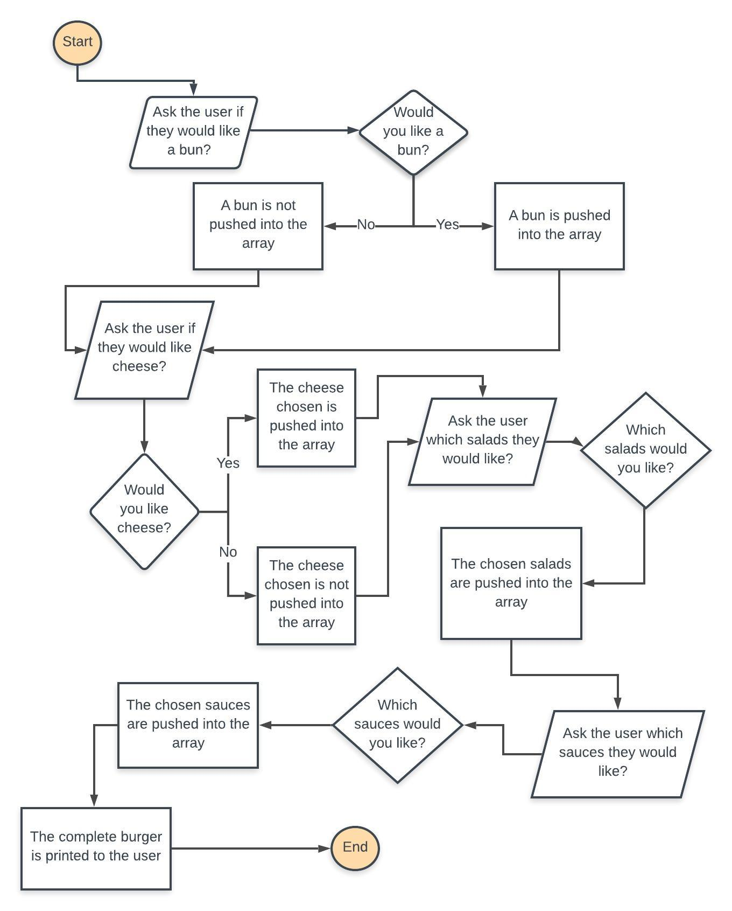

# BURGER TERMINAL APP

## GitHub Link
- [Terminal Burger App GitHub](https://github.com/MelB-24/terminal-app-burgers)


In order to run this app you must follow the following steps.

1. You must have ruby installed on your machine. I have used homebrew to do this and `rbenv`

2. Clone the repository from GitHub
```txt
git clone <name>.git
```

3. `cd` into the directory you have cloned

4. Run the build shell script. This will install all gems and create all files that are required to run the app. 
```txt
bash build.sh
```

5. `cd` into the 'dist' directory

6. Run the following command 

```txt
ruby burger.rb
```

7. If wanting to run in advanced mode
```txt
ruby burger.rb -a <NAME>
```


# Software Development Plan #

## Statement of Purpose and Scope ##

The terminal app I am building is a custom burger builder app. 

It will allow the user to select from a range of menu options to add to their burger. As the burger is built the app with add up how much the burger costs with what ingredients the customer has chosen. The app will print out the burger in ASCII art at the end, and push the build and cost into a csv file that could be used for more functionality later on.

The apps menu system will be very easy to use, it will only allow the user to select from already preset options being the ingredients that the restaurant has available. 


The app could be used by restaurants that allow this kind of ordering system. It would allow the restaurant to let the customer freely pick out what they would like in their burger and avoid mistakes in taking out items of currently built burgers at their restaurant. 


The target audience is restaurants to implement the app into their business and their customers as the users. 


This app will be used on a computer in a restaurant setting which will send the order to the kitchen for assembling and allow a customer to see how much it will cost them on their view. 

## Features ##

The features that my app will have is:

* Burger Building

This feature is the main part of the app. There is ingredients hard coded into the file. The menu system used is .prompt. There is a few different features of prompt. I have used the three main ones. The first one allows the user to enter Y or N according to if they would like a bun with their burger. This option needed error handling, as the method only allows Y or N to be entered. If the user entered anything other characters an error was thrown. I was able to put begin and rescue in a method so that the menu option would keep looping until they selected a valid character. The second option allows the user to scroll through and press enter on the one patty/cheese that they would like. This was rather simple as there is no errors thrown as they can only enter the options that are presented to them. Finally the last option is a multiple choice for the salads and sauces. Here I needed to define a method that accessed the hash and cost key and added it to the burger cost. I also needed another method that broke up the array so that an array was not pushed into the total burger array. 

* Burger Storage

This feature involves pushing the built burger and its cost into a csv file for access at a later date. The CSV file is not used again in this code however it could be used to integrate an ingredient ordering system for the restaurant, or a sales tracker. 

* Burger Pictures

The last feature that I had intended to add into the app was using an ASCII art gem. I wanted to print out multiple pictures of the burger with bites taken out of them each time. The main reason for not being able to integrate this into my app was that I couldn't find a gem that would work. I had tried to use a gem that would do exactly as I needed it to but it had not been updated in a long time and did not work with the version of ruby that we use. 

## User Interaction and Experience ##

As soon as the app is started the user will be printed the welcome greeting and asked to start building their burger. The user will interact via the key board, using the y,n keys, the enter key and the space bar for multiple selections. It will be printed out how to use these keys when the menu prints which burger ingredient they are up to. 

If the user presses the wrong button they will be printed with an 'error' message stating that they need to press a valid key, this will continue until they press this valid key. 

## Control Flow Diagram ##

